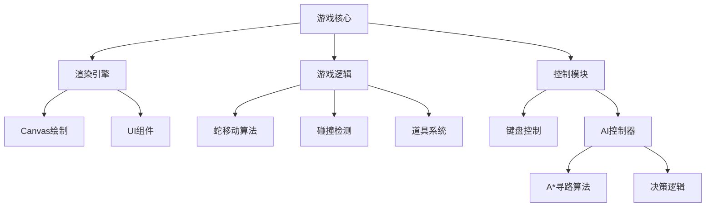

# 贪食蛇游戏设计方案

## 核心架构

## 文件结构
- `index.html`：主入口
- `style.css`：Material Design样式
- `game.js`：游戏主逻辑
- `ai-controller.js`：AI自动控制
- `level-system.js`：关卡管理系统

## 开发计划
### 1. 基础框架搭建 (1小时)
- 创建20x20网格Canvas画布
- 实现Material Design UI组件：
  - 计分板
  - 模式切换按钮
  - 开始/暂停控制

### 2. 核心游戏逻辑 (2小时)
- 蛇移动与生长算法
- 随机食物生成机制
- 碰撞检测系统（墙/自身）
- 基础计分系统

### 3. AI控制系统 (1.5小时)
- A*寻路算法实现
- 路径优化决策逻辑
- 手动/AI模式切换

### 4. 高级功能 (1.5小时)
- 关卡系统（速度/障碍物递增）
- 道具系统（加速/减速/护盾）
- 本地分数存储

## 技术规范
- 分辨率：800x600
- 色彩方案：Material Blue 500 为主色调
- 动画帧率：60fps
- 控制方式：键盘方向键+触摸支持